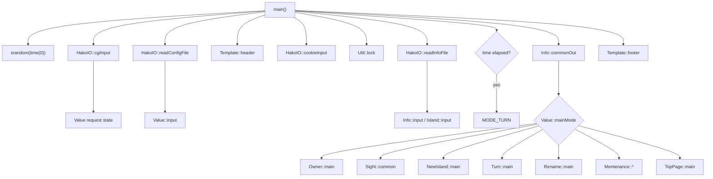
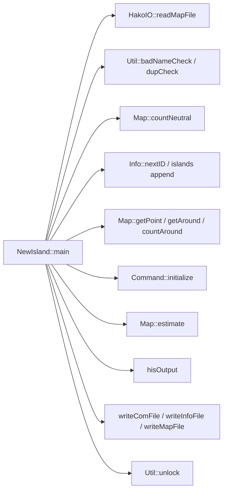

# 箱庭諸島2＋ 呼び出し関係

## 調査順と調整理由

指定された主系列を維持して、`Makefile` → `main.c` → ヘッダー → `value.c` → `map.c` → `new_island.c` → `owner.c` → `turn.c` → `command.c` → `monster.c` の順で入口とゲーム処理を確定した。

その後、永続化と補助経路を確定するため `hako_io.c` / `info.c` / `util.c` / `mentenance.c` / `template.c` / `sight.c` / `toppage.c` / `rename.c` を追跡した。`map.c` は `Info`, `HakoIO`, `Monster`, `Util` を横断し、`turn.c` はデータ保存まで呼ぶため、主ファイルだけでは呼び出し関係を閉じられないことが調整理由である。

## CGI全体

根拠：`main`, `main.c:3-146`; `HakoIO::cgiInput`, `hako_io.c:243-450`; `Value::input`, `value.c:79-164`。

## モード別ディスパッチ

| モード | 入口 | 主な下位呼出し | 根拠 |
| --- | --- | --- | --- |
| 所有者表示 | `Owner::main(0)` | password → map/com読込 → map/info/com/log JS出力 | `main.c:50-55`; `owner.c:6-58` |
| コマンド登録 | `Owner::main(1)` | `parseNumber/parseCommand` → command書込 | `main.c:57-60`; `owner.c:6-83` |
| 観光表示 | `Sight::common` | map読込 → unlock → map/info/log JS出力 | `main.c:62-65`; `sight.c:4-18` |
| 新規登録 | `NewIsland::main` | map読込 → 検証 → 地形生成 → command/info/map書込 | `main.c:67-70`; `new_island.c:3-230` |
| ターン | `Turn::main` | 全ゲームフェイズ → map/info/backup | `main.c:72-84`; `turn.c:9-148` |
| コメント | `Owner::main(2)` | password → comment更新 → info書込 | `main.c:86-89`; `owner.c:35-39` |
| 改名/パス変更 | `Rename::main` | password → 検証 → info書込 | `main.c:91-94`; `rename.c:3-87` |
| メンテ表示 | `Mentenance::common` | 現役/backup info読込 | `main.c:96-101`; `mentenance.c:4-35` |
| データ作成 | `Mentenance::makeData` | mkdir → info/map初期化・書込 | `main.c:103-108`; `mentenance.c:37-56` |
| データ削除 | `Mentenance::deleteData` | `removeData` | `main.c:110-115`; `mentenance.c:58-87` |
| 時刻変更 | `Mentenance::changeTime` | info読込/更新/書込 | `main.c:117-122`; `mentenance.c:154-160` |
| 手動backup | `Mentenance::backUpData` | `slideBack` | `main.c:124-129`; `mentenance.c:101-152` |
| backup復旧 | `Mentenance::activateData` | 現役削除 → backup rename | `main.c:131-136`; `mentenance.c:89-99` |
| 既定/top | `TopPage::main` | unlock → info JS出力 | `main.c:138-141`; `toppage.c:3-7` |

## ターン処理の呼び出し

```mermaid
flowchart TD
    A["Turn::main"] --> B["HakoIO::readMapFile → Map::input"]
    A --> C["makeOrder + makeOrderXY"]
    A --> D["HakoIO::logSlide + logOpen"]
    A --> E["Map::calcSea"]
    A --> F["Map::infLand"]
    A --> G["Island::clear2 + income"]
    A --> H["readComFile → Command::exec → Com::exec → writeComFile"]
    H --> H1["build / transfer / missile state / monster state"]
    A --> I["Map::process"]
    I --> I1["terrain growth + income"]
    I --> I2["missile resolution"]
    I --> I3["monster movement"]
    I --> I4["fire + riot"]
    A --> J["Map::getBoatPeople"]
    A --> K["Map::globalDisaster"]
    K --> K1["earthquake / tsunami / typhoon"]
    K --> K2["meteor / huge meteor / eruption / monster"]
    A --> L["Map::estimate → Info::clear + Land::estimate"]
    A --> M["delete / prize / Info::sortIslands / Map::changeOwner"]
    A --> N["logClose → writeMapFile → writeInfoFile → hisCut"]
    A --> O["Mentenance::slideBack"]
```

根拠：`Turn::main`, `turn.c:9-148`; 各関数定義は `map.c:178-1400`, `command.c:37-723`, `info.c:41-373`, `hako_io.c:38-652`, `mentenance.c:107-152`。

## 新規登録の呼び出し

根拠：`NewIsland::main`, `new_island.c:3-230`。

## データI/Oの呼び出し

| 上位処理 | I/O関数 | モデル関数 | ファイル |
| --- | --- | --- | --- |
| 全モード共通 | `readInfoFile` / `writeInfoFile` | `Info::input/output`, `Island::input/output` | `info.cgi` |
| 地図表示・登録・ターン | `readMapFile` / `writeMapFile` | `Map::input/output`, `Land::input/output` | `map.cgi` |
| 所有者・登録・ターン | `readComFile` / `writeComFile` | `Command::input/output`, `Com::input/output` | `command<ID>.cgi` |
| ターン・イベント | `logOpen/logOutput/logClose` | 数値9項目 | `logfile0.cgi` |
| 発見・消滅・改名 | `hisOutput/hisCut` | 履歴4項目 | `loghis.cgi` |

根拠：`hako_io.c:38-152,467-652`; `info.c:75-214`; `map.c:27-47,1233-1255`; `command.c:62-71,110-117`。

## ファイル責務

| ファイル | 主責務 |
| --- | --- |
| `main.c` | CGIライフサイクル、時刻判定、モードdispatch |
| `value.c/.h` | 設定とCGI要求のグローバル状態 |
| `hako_io.c/.h` | CGI decode、Cookie、平文ファイル、ログ、出力 |
| `info.c/.h` | 世界メタデータ、国家レコード、収支、受賞 |
| `map.c/.h` | 全世界配列、座標、領土、セル処理、戦闘、災害 |
| `command.c/.h` | コマンドキュー、費用、コマンド実行 |
| `turn.c/.h` | ターン全体のオーケストレーション |
| `new_island.c/.h` | 新規国家検証・初期地形生成 |
| `owner.c/.h` | 所有者画面、コマンド文字列parse |
| `monster.c/.h` | 怪獣データとparam encode/decode |
| `mentenance.c/.h` | データ初期化、削除、backup、復旧、時刻変更 |
| `util.c/.h` | 名前検証、hex、乱数、Shift_JIS切詰め、認証、lock |
| `template`, `sight`, `toppage`, `rename` | HTML/JS出力と補助モード |

## 構造上の観察

**確定**：各クラスは静的フィールドを多用し、`Map`, `Info`, `Value`, `HakoIO`, `Command` が相互参照する。ヘッダーにも循環includeがあり、`main.h` は自身をincludeする（`main.h:4-15`）。

**設計判断**：新作では、入口、ユースケース、ドメイン、永続化、表示を依存方向で分離する。特に `Map::process` の施設・災害・戦闘switchと、`Com::exec` の検証・課金・遷移・ログ生成を個別の規則/サービスへ分ける必要がある。
