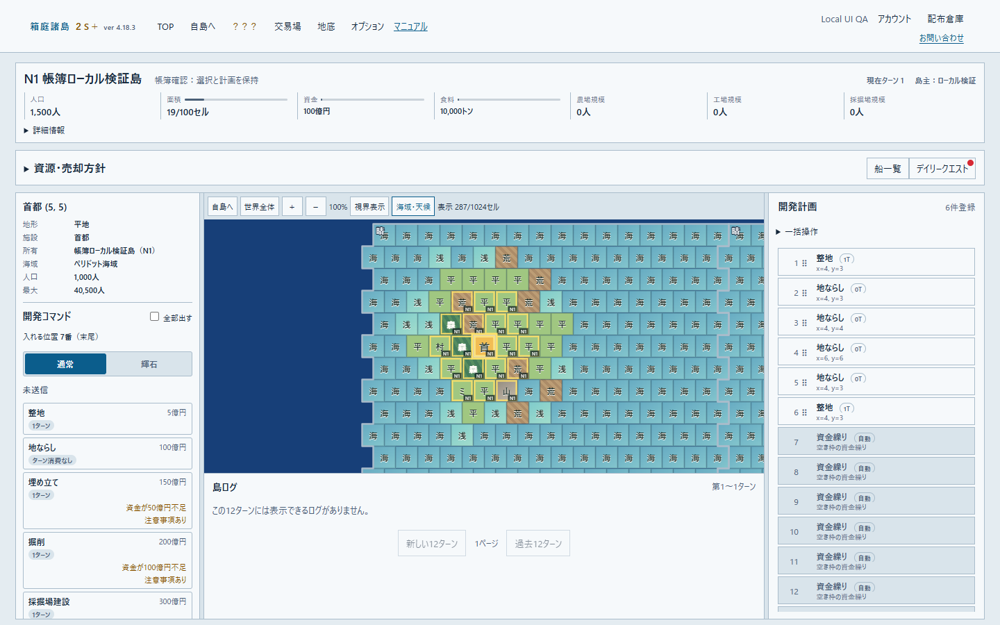
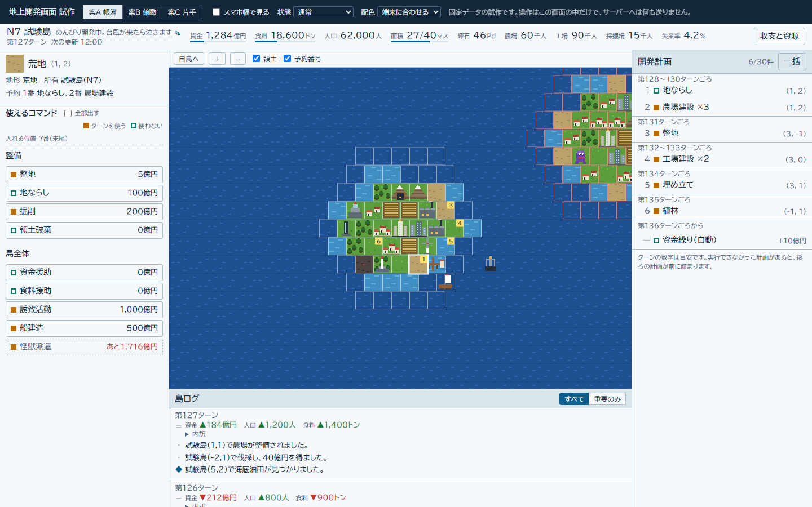
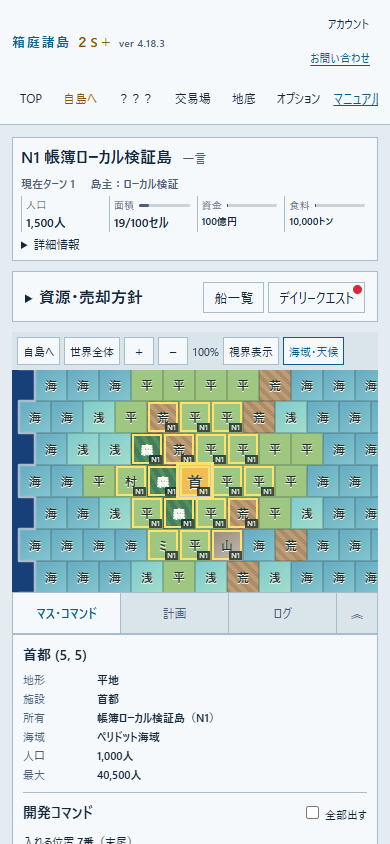
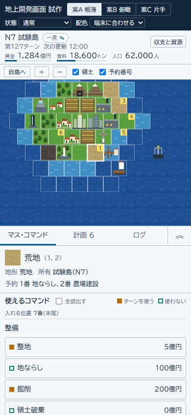

# 5.0.0 地上案A「帳簿」実装・Owner確認資料

地上の開発画面を、左のマス情報・コマンド、中央の地図・島ログ、右の開発計画へ配置した。スマホでは地図の下に「マス・コマンド／計画／ログ」を切り替えるタブを置き、︽でパネルを画面上まで広げる。追加後も拡張と選択を維持する。第一弾の地上案Aだけを `release/5.0.0` に集約し、main向けのdraft PR一本でOwner確認を待つ。

## 基準と範囲

- 基準main: `be0011c926f78037363e7efce1fdc8664b8789d1`。
- 専用worktree: `surface-ledger`。作成前に同名remote branchがないことを確認して `release/5.0.0` を作成した。既存checkout・他作業の変更は持ち込んでいない。
- 正式依頼書: Library `libfile_11f5739f5e908191b442896e7bd9a4bd` / `peridot-implementation-brief.md`、全文確認済み。
- 設計資料: [`claude/ui-prototype-surface` の `ceab2b3c040091ed201f8776cfb1150bb5b8d0c8`](https://github.com/Mamiki765/hakoniwa-world/tree/ceab2b3c040091ed201f8776cfb1150bb5b8d0c8/product/tools/ui-prototypes)。READMEを先に読み、試作runtimeはこのPRに含めていない。
- 最新添付: `ui-prototypes-ceab2b3.zip`、Library `libfile_42f6abcc3f94819187ec4b5b8777d59a`、129458 bytes、SHA256 `11fb5f1a4d897b89cab25b7b300ab939c08b8dd2df66cd9df76b012d072a18a6`（受領側の確認情報）。このPCでは正規Library materializeが利用できず、同じGit commitを取得して比較に使用した。古いZIPは使っていない。
- 実装は `product/resources/js` と地上CSS、関連テスト、検証資料。PHPの変更はOwner承認済みの `app.blade.php` cookie許可値 `old-light` / `old-dark` 二つの追加だけ。
- server・API・schema・Ruleset・ゲームルールの変更なし。merge・deploy・本番DB操作なし。他の試作画面はこのPRの対象に含めていない。

## 採用した操作

- PC三列の境界をドラッグして幅を端末に保存する。矢印キーでも変更でき、Homeまたはダブルクリックで既定幅へ戻せる。
- 地図の詳細はmouse hoverとキーボードfocusで表示し、touchでは表示しない。既存のマス選択・視界・海域天候・zoom・自島移動を維持する。
- コマンドはAPIの既存「通常／輝石」を使う。「全部出す」で現在不可の先読み候補を表示する。独自分類や日本語warning解析、地形ルールの複製は行わない。
- 通常登録は選択した明示計画の次の位置、選択した自動資金繰り枠ならその位置。未選択なら最後の `queue_position + 1`。登録成功後は返却された新規計画を選択する。
- 計画の位置はAPIの `queue_position` / `plan.position` を正とする。空き枠を一覧indexへ詰め替えない。対象変更・競合は既存のversion・context検証を維持する。
- 一括は選択行の位置から、未選択なら1番から。既存の四操作だけを使い、POST前に空き件数と末尾取消の可能性を確認する。返却された取消件数を表示する。空き枠を挟む一括は下記の理由で停止する。
- 島名の右の一言をinline編集する。1行100字以内、PATCH profileへ `comment` だけを送り、地図・計画・拡張状態を再読み込みしない。スマホは小さな「一言」ボタンから開く。
- New Light / New Dark / Old Light / Old Dark / skyblue / autumn / blackをCSS tokenへ分けた。`data-theme` と `hakoniwa_theme` を維持し、Oldのcookieも初期Blade描画から反映する。外部Webフォントを追加していない。新しい地上の配色は地上画面に適用し、他画面の刷新は別途行う。

## 同じサイズでの実画面・試作比較

ローカルの実Laravel API・新規DBで作った島をChromeで撮影した。試作は固定データの設計資料であり、実画面と数値・地形・計画件数を同じにするためのデータ注入は行っていない。

| サイズ | 実画面 | 試作ceab2b3 |
|---|---|---|
| PC 1440×900 | [実画面](5.0.0-surface-ledger/actual-pc.png) | [試作](5.0.0-surface-ledger/prototype-pc.png) |
| スマホ 390×844 | [実画面](5.0.0-surface-ledger/actual-mobile.png) | [試作](5.0.0-surface-ledger/prototype-mobile.png) |

追加証跡: [スマホ拡張](5.0.0-surface-ledger/actual-mobile-expanded.png)、[一括確認](5.0.0-surface-ledger/actual-pc-bulk-confirmation.png)、[New Dark](5.0.0-surface-ledger/actual-pc-dark.png)、[Old Light](5.0.0-surface-ledger/actual-pc-old-light.png)、[Old Dark](5.0.0-surface-ledger/actual-pc-old-dark.png)。

### 差分と理由

| 実画面での差分 | 理由 |
|---|---|
| HUDと既存ナビ・資源欄を残し、スマホの地図開始位置が試作より下 | 七画面全体のナビ刷新を地上だけのPRへ混ぜず、既存資源・船・デイリークエストの入口を保持した。スマホでは農場・工場・採掘場の三項目を詳細内へ移した。 |
| 地図toolbarに「視界表示」「海域・天候」「世界全体」を残す | 試作にない実機能を失わないため。海域境界・天候・船視界は既存APIと描画をそのまま使う。 |
| 通常／輝石、API返却コマンド・料金・警告を表示 | 試作の分類名や固定値を持ち込まず、現行catalogの条件を使うため。 |
| 資金不足だけで先読み予約を禁止しない。一部の現在不適合コマンドも通常表示に残る | 現APIの現在不可理由には地形と資金が混在する。shortfallのある候補を保守的に残し、地形だけの推測はしない。 |
| 計画の空き枠を自動資金繰りとして表示し、架空の完了ターン見積りを追加しない | APIの位置と既存実行順を保持するため。試作のターン表は確定API情報ではない。 |
| ログは既存の12ターン単位表示・重要度マーク | 新しい集計やfixtureログを作らず、owner向け実ログを中央下へ移した。 |
| タイル・天候画像の一部は既存rendererのfallback表示 | タイルは外部asset配備に依存する。この隔離環境には配備先assetがなく、本番画像の抽出はしていない。仮タイルの導入はしていない。 |

## 確認操作と結果

隔離したPostgreSQL 18.4とLaravel開発containerを使用し、Webは `127.0.0.1:18080` のみへbindした。fresh migration/world init後、ローカル検証userとAPIで新規島を作成した。既存container・本番データは利用していない。CUAはWindows launcherエラーで起動できなかったため、インストール済みChromeの正規headless起動とPlaywrightによる開発画面検証を使用した。画像生成による代替なし。

| 操作 | 結果 |
|---|---|
| PCでマスhover、視界・天候toggle | API由来のマス詳細が表示され、既存toggle状態が切り替わった。 |
| 左列を48px広げて再訪、Homeで復元 | 保存幅312pxを再訪時に復元し、Homeで264pxへ戻った。 |
| 自動枠5番へ通常登録、返却計画を選択したまま次を登録 | POST位置は5→6。先頭の空き枠1〜4を維持した。 |
| inlineコメント保存 | PATCH bodyは `comment` だけ。マス・計画選択とqueueを維持した。 |
| 空き枠を挟む計画で一括 | 説明を表示してPOSTを送らなかった。 |
| 連続計画の2番を選択して一括 | POST前の確認に位置2・空き件数・末尾取消注意を表示。実APIへ位置2で送信し、返却queueを反映した。 |
| スマホでマスtap・︽・通常追加・計画/ログ切替 | hoverなし。追加後も拡張を維持し、既存panelを再mountせず切り替えた。 |
| 七つのtheme cookieで再訪 | 初期Bladeの `data-theme` とVue初期値が一致し、各tokenを反映した。 |
| 1440×900 / 390×844 | document横overflowなし。browser JS errorなし。 |

- `npm ci`: lockfile通りに復元。
- `vue-tsc --noEmit`: pass。
- ESLint: error 0。既存 `UndergroundPanel.vue` の `v-html` warning 6件。
- 関連Vitest: `CommandAndSalePanels.surface.test.ts` / `HexMap.surface.test.ts`、60 tests pass。資金不足の予約、先読み、安全でない先読み除外、空き枠保持、一括停止、確認前POSTなし、上限超過時の返却queue反映を境界として確認した。
- 第8章の反証確認: 新規caseはcatalog表示順の変更でpassし、不足候補を隠す・選択行の後ろを同じ位置へ戻す・疎な一括の停止を外す三つの局所mutationでそれぞれfailした。mutationは検証後に復元した。無関係な既存case全件へのmutationは行っていない。
- Vite production build: pass。既存規模のbundle size warningあり。
- `git diff --check`: pass。
- 全PHP suite・全repo suiteは実行していない。AGENTS.md第8章に従い無関係なテスト整理を混ぜず、PRの固定head CIを全体判定の根拠にする。CIはこのローカル検証結果とは別に確認する。

## 判断待ち・Claude向けTODO

この節は設計引継ぎであり、Claudeへの送信や未承認server変更の実行を意味しない。

1. **空き枠を保つ一括API**: `CommandQueueService` のbulkは位置でprefix/suffixを分けるが、保存時に残る全項目を `index + 1` で並べ直す。例えば明示計画が5・6番にあり6番から三件追加すると、結果は1〜5番へ詰まり、元の自動枠1〜4を失う。Ownerが許可した「上限超過時の末尾取消」とは別の問題。今回のUIは明示位置が1から連続していない場合、または挿入先が連続prefixの直後より先の場合のbulkを停止する。server/APIの範囲を別途承認して位置保持を実装するか、この制限を採用するか判断が必要。
2. **地形適合と不足資源の区別**: `available` / `applicable` は対象選択の有無を含むflagで、地形適合そのものではない。`execution_preview_status=currently_unavailable` も理由が混在する。現UIは `shortfall_money=0` かつ `shortfall_paradox=0` の現在不可候補を全部表示側へ移し、不足ありを通常側に残す。地形と不足が両方ある候補は混ざる。正確な「現在適合」filterには、APIが構造化した不可理由を返す設計判断が必要。warning文の解析・フロント地形ルール追加は不可。
3. **一括の事前件数**: 空き件数は表示できるが、candidate数と実際の末尾取消数はPOST後の返却値でしか確定しない。事前の確定件数が必要なら既存APIの別承認事項。フロントで候補地形を数え直さない。
4. **試作にない視界・海域・天候の配置案**: 今回は地図toolbarに既存toggleを保持した。次案は同じtoolbarで「表示状態」の入口をまとめ、選択マスの海域・実天候を既存レスポンスから表示する。スマホで折りたたむ場合もon/off状態と凡例にアクセスできる配置にする。日時・更新turn等はAPIに存在する値だけを使う。架空の予報・天候効果・操作名は追加しない。表示集約の採否をOwnerへ提示してから実装する。
5. **スマホの片手操作案**: 帳簿の情報構造を保ち、下の三タブと拡張を使う現案で確認を受ける。次の調整候補はナビ集約、親指範囲の拡張toggle、操作targetの大きさ、入力keyboard表示時の保存/取消配置。案Cへ全面切替する前に実機で比較する。
6. **配備assetでの再確認**: 正規のローカルassetを配置できた環境で実タイル・天候GIF・各theme背景を確認する。本番データ・非公開assetの抽出/外部共有はこの依頼に含めない。
7. **完了turn表・ログ集約**: 試作の見積りturnや収支差分集約を、frontend独自計算で足さない。必要なら既存APIが出す公式情報と表示要件を先に確認する。
8. **残りの画面**: TOP・秘書・地底・戦闘ログ・全体ナビ・管理は今回未実装。地上のOwner確認後に5.0.0へ集約する進め方を決める。このPRでは七本のPRやCI連打を作っていない。

未確認: 実iOS/Safari、実機の片手到達範囲・仮想keyboard・safe area、外部配備の実画像、production同等の大量計画/ログの見た目、PR固定headでの全体CI。ローカルURLはPC上だけの検証用で、外部公開はしていない。
